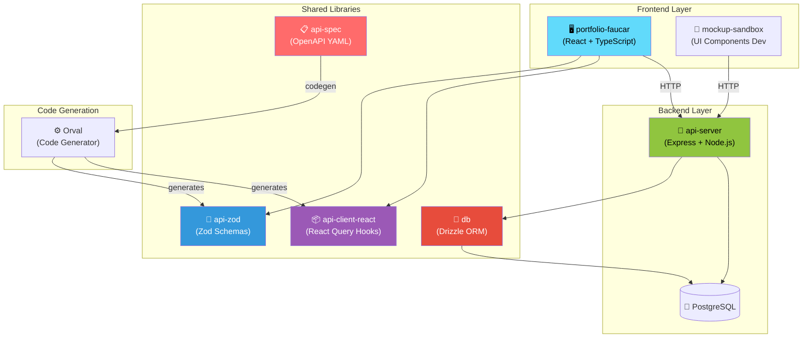
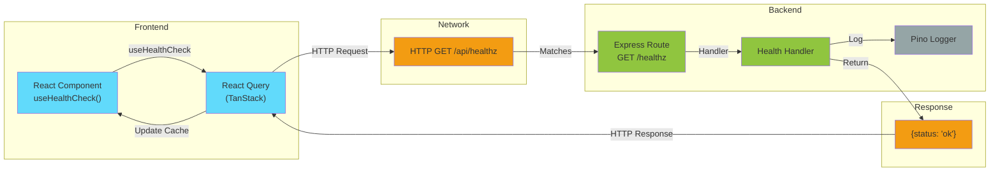
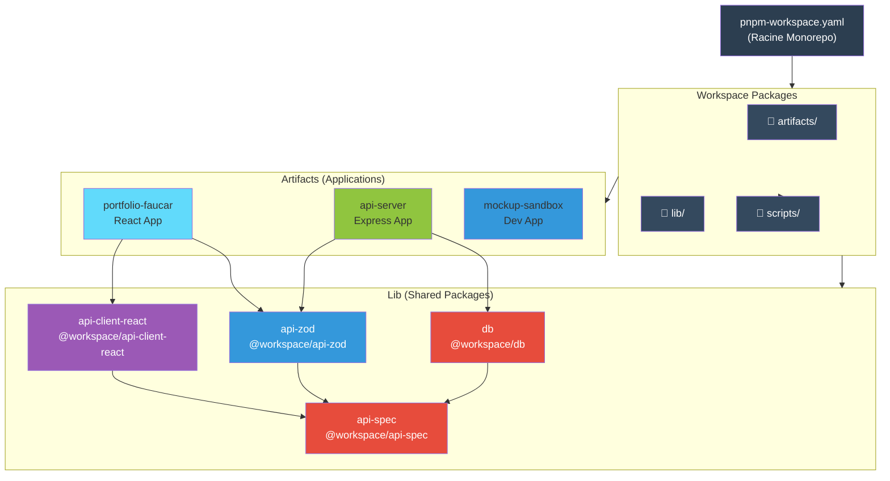
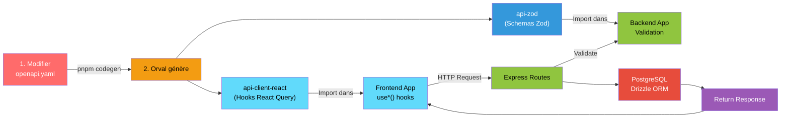
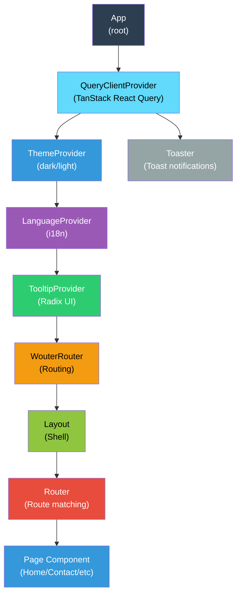
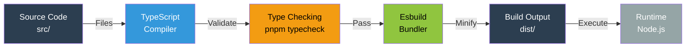
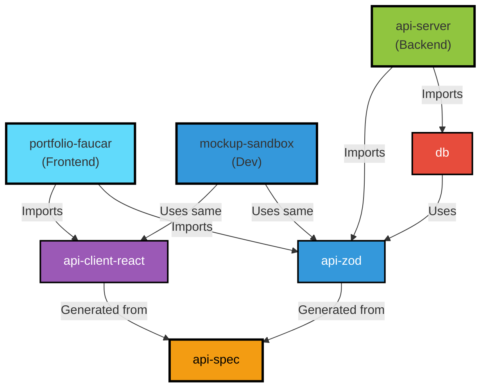
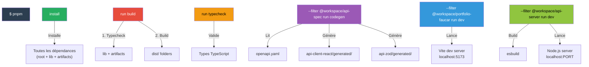

# 📊 Diagrammes du Projet Faucar

## Architecture générale



## Flux de données Frontend → Backend



## Structure TypeScript dans le Monorepo



## Lifecycle du développement API



## Routes Frontend actuelles

```
application/
├── /                      → Home
├── /a-propos              → APropos
├── /mes-services          → MesServices
├── /realisations          → Portfolio
├── /mon-processus         → MonProcessus
├── /contact               → Contact
├── /faq (route inexistante)
├── /temoignages (route inexistante)
└── /projets-en-cours (route inexistante)
```

**Fichiers pages existants mais non routés :**
- `Faq.tsx` ❌ Pas de route
- `Temoignages.tsx` ❌ Pas de route
- `ProjetsEnCours.tsx` ❌ Pas de route

## Hiérarchie des Providers React



## Pipeline de Build TypeScript



## Dependency Graph - What imports what



## Commandes principales et leur effet



---

*Visualisations du projet Faucar - 2026-08-15*
